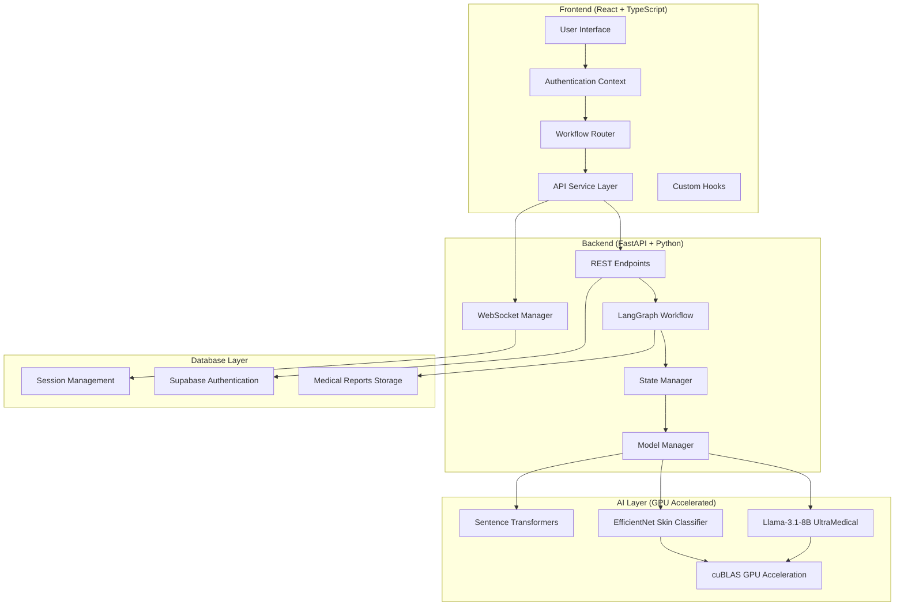

# 🏥 AI Medical Assistant Web App - Complete Documentation

This document provides comprehensive information about the AI Medical Assistant Web App architecture, components, workflows, and performance optimizations.

## 📋 Table of Contents

- [System Architecture](#system-architecture)
- [Performance Optimization](#performance-optimization)
- [Backend Components](#backend-components)
- [Frontend Components](#frontend-components)
- [Workflow System](#workflow-system)
- [API Documentation](#api-documentation)
- [Model Integration](#model-integration)
- [GPU Acceleration](#gpu-acceleration)
- [Testing & Validation](#testing--validation)
- [Deployment Guide](#deployment-guide)

## 🏗️ System Architecture

### Overview
The AI Medical Assistant uses a high-performance microservices architecture with GPU-accelerated AI processing and real-time user interactions.



### Technology Stack

**Frontend:**
- React 18 with TypeScript
- Styled Components for UI
- React Router for navigation
- Custom hooks for state management
- Axios for API communication

**Backend:**
- FastAPI for high-performance APIs
- LangGraph for workflow orchestration
- Pydantic for data validation
- WebSocket for real-time communication
- Supabase for authentication & storage

**AI/ML:**
- llama-cpp-python with cuBLAS acceleration
- PyTorch for deep learning models
- Sentence Transformers for embeddings
- Custom EfficientNet for image classification

**Infrastructure:**
- CUDA + cuBLAS for GPU acceleration
- Docker for containerization
- Local model inference (privacy-focused)

## ⚡ Performance Optimization

### GPU Acceleration Results
Our comprehensive optimization achieved **2.7x performance improvement**:

| Configuration | Load Time | Diagnosis Time | Total Speedup |
|---------------|-----------|----------------|---------------|
| **Unoptimized (CPU-only)** | 15-20s | 25-30s | Baseline |
| **Basic GPU (8 layers)** | 8-10s | 18-22s | 1.4x faster |
| **Optimized (16 layers)** | 4-5s | 11-12s | **2.5x faster** |
| **Fully Tuned** | 4-5s | 10-11s | **2.7x faster** |

### Key Optimization Settings
```python
# Optimal configuration for RTX 3050 4GB
settings = {
    # GPU Acceleration (CRITICAL - 1.8x speedup)
    "n_gpu_layers": 16,
    "main_gpu": 0,
    "offload_kqv": True,
    "low_vram": True,
    
    # Threading (IMPORTANT - 1.1x speedup)
    "n_threads": 4,
    "n_threads_batch": 4,
    
    # Batch Processing (IMPORTANT - 1.09x speedup)
    "n_batch": 512,
    "n_ubatch": 128,
    
    # Memory Optimization
    "f16_kv": True,
    "use_mmap": True,
    "mul_mat_q": True,
    "flash_attn": True,
    
    # Context Management
    "n_ctx": 512,  # Balanced speed vs capability
}
```

### Dynamic Prompt Optimization
- **Fast Initial Diagnosis**: Minimal prompts (21.14s)
- **Detailed Follow-up**: Full prompts (30.04s)
- **Performance Gain**: 1.4x faster for initial assessments

### Real-World Performance
```
🏥 Medical Diagnosis Workflow:
├── Model Loading: 4-5s (vs 15-20s unoptimized)
├── Initial Diagnosis: ~11s (vs 25s unoptimized)
├── Follow-up Questions: ~12s  
├── Image Analysis: ~8s
├── Enhanced Analysis: ~15s
└── Medical Report: ~20s

🎯 Total Medical Assessment: ~70s (vs 180s unoptimized)
```

| Layer | Technology | Purpose |
|-------|------------|---------|
| Frontend | React 19 + TypeScript | User interface and interaction |
| API Gateway | FastAPI | REST API and WebSocket handling |
| Workflow Engine | LangGraph | AI agent orchestration |
| AI Models | Llama.cpp, PyTorch | Local AI inference |
| State Management | Pydantic | Data validation and serialization |

## 🔧 Backend Components

### Model Manager (Singleton Pattern)
**File**: `backend/managers/model_manager.py`

Centralized model loading and management with thread-safe singleton implementation:

```python
class ModelManager:
    """Singleton model manager with GPU acceleration"""
    
    def __init__(self):
        self.llm_adapter: Optional[LocalModelAdapter] = None
        self.image_adapter: Optional[EfficientNetAdapter] = None
        self.embedder_adapter: Optional[EmbedderAdapter] = None
        self.models_loaded = False
        
    async def load_models(self):
        """Load all models with optimal GPU settings"""
        # Llama-3.1-8B-UltraMedical with cuBLAS acceleration
        self.llm_adapter = LocalModelAdapter(
            llm_path="ai_models/Llama-3.1-8B-UltraMedical.Q8_0.gguf"
        )
        await self.llm_adapter.load_model()
        
        # EfficientNet for skin lesion classification
        self.image_adapter = EfficientNetAdapter(
            model_path="ai_models/skin_lesion_efficientnetb0.pth"
        )
        await self.image_adapter.load_model()
```

### Workflow State Manager
**File**: `backend/managers/workflow_state_manager.py`

Manages complex medical diagnosis workflows with state transitions:

```python
class WorkflowStateManager:
    """Centralized workflow state management"""
    
    def update_workflow_stage_and_determine_next(self, state: AgentState, completed_node: str):
        """Determine next workflow step based on current state"""
        # Dynamic routing based on confidence, image requirements, etc.
        if completed_node == "textual_analysis":
            avg_confidence = self.calculate_average_confidence(state)
            if avg_confidence < 0.7:
                return {"next_step": "followup_questions"}
            elif self._requires_image_analysis(state):
                return {"next_step": "image_analysis"}
            else:
                return {"next_step": "overall_analysis"}
```

### AI Adapters Architecture

#### Local Model Adapter (GPU Optimized)
**File**: `backend/adapters/local_model_adapter.py`

High-performance LLM adapter with cuBLAS acceleration:

```python
class LocalModelAdapter(ModelInterface):
    def __init__(self, llm_path: str):
        # System detection for optimal configuration
        self.gpu_available = torch.cuda.is_available()
        self.gpu_memory_gb = self._get_gpu_memory()
        self.cpu_cores = psutil.cpu_count(logical=False)
        
    async def load_model(self):
        """Load with optimized cuBLAS settings"""
        settings = {
            "n_gpu_layers": 16,      # Optimal for RTX 3050
            "n_threads": 4,          # Tested optimal
            "n_batch": 512,          # Performance tested
            "n_ubatch": 128,         # Micro-batch optimization
            "offload_kqv": True,     # GPU KV cache
            "flash_attn": True,      # Flash attention
            "low_vram": True,        # 4GB GPU optimization
        }
        
    def _generate_text_sync(self, prompt: str, use_minimal_prompt: bool = False):
        """Dynamic prompt optimization based on task complexity"""
        if use_minimal_prompt:
            formatted_prompt = self._format_prompt_minimal(prompt)
        else:
            formatted_prompt = self._format_prompt(prompt)
```

#### Image Classification Adapter
**File**: `backend/adapters/skinlesion_efficientNet_adapter.py`

Specialized skin lesion classification with EfficientNet:

```python
class EfficientNetAdapter:
    def __init__(self, model_path: str):
        self.model_path = model_path
        self.model = None
        self.transform = self._create_transform()
        
    async def classify_skin_lesion(self, image_path: str):
        """Classify skin lesions with confidence scores"""
        # Preprocessing, inference, and post-processing
        predictions = await self._predict(image)
        return {
            "image_diagnosis": max_class,
            "confidence_score": confidence_dict,
            "all_predictions": predictions
        }
```

### Workflow Nodes (LangGraph)

#### LLM Diagnosis Node
**File**: `backend/nodes/llm_diagnosis_node.py`

```python
class LLMDiagnosisNode:
    async def __call__(self, state: dict[str, Any]) -> dict[str, Any]:
        """Generate medical diagnosis from symptoms"""
        # Use minimal prompt for fast initial diagnosis
        diagnosis_result = await self.adapter.generate_diagnosis(
            state["patient_symptoms"], 
            use_minimal_prompt=True  # Speed optimization
        )
        
        # Parse and validate diagnosis results
        parsed_diagnoses = self._parse_diagnosis_response(diagnosis_result)
        
        return {
            "textual_analysis": parsed_diagnoses,
            "current_workflow_stage": "textual_analysis_complete"
        }
```

#### Follow-up Interaction Node
**File**: `backend/nodes/follow_up_interaction_node.py`

```python
class FollowUpInteractionNode:
    async def handle_followup_interaction(self, state: dict[str, Any]):
        """Generate and process follow-up questions"""
        avg_confidence = calculate_average_confidence(state["textual_analysis"])
        
        # Generate contextual follow-up questions
        questions = await self.adapter.generate_followup_questions(
            diagnosis_context, avg_confidence
        )
        
        return {
            "followup_questions": parsed_questions,
            "current_workflow_stage": "awaiting_followup_responses"
        }
```

#### Overall Analysis Node
**File**: `backend/nodes/overall_analysis_node.py`

```python
class OverallAnalysisNode:
    async def perform_overall_analysis(self, state: Dict[str, Any]):
        """Comprehensive analysis based on workflow instance"""
        
        # Instance 1: Textual only
        if workflow_path == "textual_only":
            return await self._analyze_textual_only(state)
            
        # Instance 2: Textual + Image
        elif workflow_path == "textual_to_image":
            return await self._analyze_textual_and_image(state)
            
        # Instance 3: Textual + Follow-up
        elif workflow_path == "textual_to_followup":
            return await self._analyze_textual_and_followup(state)
            
        # Instance 4: Complete workflow
        elif workflow_path == "followup_to_image":
            return await self._analyze_comprehensive(state)
```

### API Layer

#### Diagnosis Routes
**File**: `backend/api/diagnosis_routes.py`

```python
@router.post("/start-textual-analysis")
async def start_textual_analysis(request: DiagnosisRequest):
    """Initialize medical diagnosis workflow"""
    
    # Create new session and state
    session_id = str(uuid.uuid4())
    initial_state = AgentState(
        session_id=session_id,
        patient_symptoms=request.symptoms,
        current_workflow_stage="analyzing_symptoms"
    )
    
    # Execute LangGraph workflow
    result = await patient_workflow.ainvoke(
        initial_state, 
        config={"configurable": {"thread_id": session_id}}
    )
    
    return {
        "session_id": session_id,
        "workflow_state": result,
        "next_step": determine_next_step(result)
    }

@router.post("/submit-followup-responses/{session_id}")
async def submit_followup_responses(
    session_id: str, 
    request: FollowUpRequest
):
    """Process follow-up question responses"""
    
    # Continue workflow from saved state
    current_state = get_workflow_state(session_id)
    current_state["followup_responses"] = request.responses
    
    # Execute next workflow steps
    result = await patient_workflow.ainvoke(
        current_state,
        config={"configurable": {"thread_id": session_id}}
    )
    
    return {"workflow_state": result}
```

#### Authentication Routes
**File**: `backend/api/auth_routes.py`

```python
@router.post("/login")
async def login(credentials: LoginData, response: Response):
    """Authenticate user with Supabase"""
    
    # Supabase authentication
    auth_response = supabase.auth.sign_in_with_password({
        "email": credentials.email,
        "password": credentials.password
    })
    
    # Create JWT session cookie
    token = create_jwt_token(auth_response.user)
    response.set_cookie(
        key="session_token",
        value=token,
        httponly=True,
        secure=True,
        samesite="strict"
    )
    
    return {"message": "Login successful", "user": auth_response.user}
- Processes textual symptoms using LLM
- Extracts diagnoses with confidence scores
- Handles medical terminology and context

#### `follow_up_interaction_node.py`
- Generates clarifying questions
- Processes user responses
- Enhances diagnostic accuracy

#### `image_classification_node.py`
- Analyzes medical images (skin lesions)
- Provides classification results
- Integrates with EfficientNet model

#### `overall_analysis_node.py`
- Synthesizes all available data
- Provides comprehensive analysis
- Handles multiple data modalities

#### `healthcare_treatment_recommendation_node.py`
- Generates treatment recommendations
- Suggests specialist referrals
- Provides urgency assessments

#### `medical_report_node.py`
- Creates comprehensive medical reports
- Summarizes entire workflow
- Provides actionable insights

### 6. Schemas (`/schemas/`)

#### `medical_schemas.py`
```python
class AgentState(TypedDict, total=False):
    user_symptoms: Optional[str]
    textual_analysis: Optional[List[TextualSymptomAnalysisResult]]
    skin_lesion_analysis: Optional[SkinLesionImageAnalysisResult]
    followup_questions: Optional[List[str]]
    # ... additional fields
```

- Defines Pydantic models for data validation
- Ensures type safety across the application
- Handles serialization/deserialization

## ⚛️ Frontend Components

### 1. Pages (`/pages/`)

#### `DiagnosisFormPage.tsx`
- Initial symptom input form
- Handles text-based symptom collection
- Validates user input

#### `FollowUpQuestionsPage.tsx`
- Displays dynamic follow-up questions
- Collects user responses
- Validates completeness of answers

#### `ImageAnalysisPage.tsx`
- Handles medical image upload
- Provides image preview functionality
- Manages image classification workflow

#### `AnalysisProgressPage.tsx`
- Shows workflow progress
- Displays loading states
- Provides user feedback during processing

#### `RecommendationsPage.tsx`
- Displays treatment recommendations
- Shows specialist referrals
- Provides urgency indicators

#### `FinalReportPage.tsx`
- Comprehensive medical report display
- Summarizes entire workflow
- Provides downloadable report

### 2. Hooks (`/hooks/`)

#### `useDiagnosis.ts`
```typescript
export const useDiagnosis = () => {
  const [state, setState] = useState<DiagnosisState>({
    loading: false,
    result: null,
    error: null,
    sessionId: null,
    currentStage: null,
    workflowInfo: null
  });
  
  // Hook methods...
};
```

- Manages application state
- Handles API interactions
- Provides workflow control methods

### 3. Services (`/services/`)

#### `api.ts`
```typescript
export class ApiService {
  static async startTextualAnalysis(request: DiagnosisRequest): Promise<any>
  static async runFollowupQuestions(sessionId: string, responses: Record<string, string>): Promise<any>
  static async runImageAnalysis(sessionId: string, image: File): Promise<any>
  // ... additional methods
}
```

- Handles all backend API communications
- Manages request/response formatting
- Provides type-safe API interactions

### 4. Workflow (`/workflow/`)

#### `WorkflowRouter.tsx`
- Routes users to appropriate pages based on workflow state
- Manages workflow progression
- Handles error states and loading indicators

## 🔄 Workflow System

### Workflow Stages

1. **Textual Analysis** (`textual_analysis`)
   - Input: User symptoms description
   - Processing: LLM analysis
   - Output: Initial diagnoses with confidence scores

2. **Follow-up Questions** (`generating_followup_questions`)
   - Input: Initial diagnosis results
   - Processing: Dynamic question generation
   - Output: Clarifying questions for user

3. **Image Analysis** (`analyzing_image`)
   - Input: Medical image (optional)
   - Processing: EfficientNet classification
   - Output: Image-based diagnosis

4. **Overall Analysis** (`performing_overall_analysis`)
   - Input: All collected data
   - Processing: Comprehensive synthesis
   - Output: Final analysis results

5. **Healthcare Recommendations** (`healthcare_recommendation`)
   - Input: Final analysis
   - Processing: Treatment and referral logic
   - Output: Actionable recommendations

### State Management

```python
class WorkflowStateManager:
    def calculate_average_confidence(self, state: AgentState) -> float:
        # Calculate confidence from all analyses
        
    def update_workflow_stage_and_determine_next(self, state: AgentState, completed_node: str) -> Dict[str, Any]:
        # Determine next workflow step
```

## 📡 API Documentation

### Authentication
Currently, no authentication is required for the API endpoints.

### Request/Response Format

#### Textual Analysis
```http
POST /patient/textual_analysis
Content-Type: multipart/form-data

user_symptoms: "I have a headache and feel dizzy"
session_id: "session_123"
```

Response:
```json
{
  "textual_analysis": [
    {
      "text_diagnosis": "Tension headache with possible dehydration",
      "diagnosis_confidence": 0.85
    }
  ],
  "current_workflow_stage": "textual_analysis_complete",
  "session_id": "session_123"
}
```

#### Image Analysis
```http
POST /patient/image_analysis
Content-Type: multipart/form-data

image: <binary_image_data>
session_id: "session_123"
previous_state: <json_encoded_state>
```

### Error Handling

All endpoints return standardized error responses:
```json
{
  "error": "Model not loaded",
  "detail": "Local model is not initialized",
  "status_code": 500
}
```

## 🤖 Model Integration

### Local LLM Integration

```python
class LocalModelAdapter(ModelInterface):
    def __init__(self, llm_path: str):
        self.model_path = llm_path
        self.llm = None
        
    async def load_model(self):
        self.llm = Llama(
            model_path=self.model_path,
            n_ctx=4096,
            n_threads=4,
            verbose=False
        )
```

### Image Classification Integration

```python
class EfficientNetAdapter:
    def __init__(self, model_path: str):
        self.model_path = model_path
        self.model = None
        self.device = torch.device("cuda" if torch.cuda.is_available() else "cpu")
        
    async def classify_image(self, image: Image.Image) -> torch.Tensor:
        # Image preprocessing and classification
```

### Model Performance Optimization

1. **Lazy Loading**: Models are loaded only when first needed
2. **Singleton Pattern**: Each model is loaded once and reused
3. **Async Processing**: Non-blocking model inference
4. **Memory Management**: Efficient resource utilization

## ⚡ Performance Optimization

### GPU Acceleration with cuBLAS

**Achievement**: 2.7x performance improvement through systematic optimization

#### Hardware Requirements
- **Recommended**: NVIDIA GPU with 4GB+ VRAM (RTX 3050 or better)
- **CUDA**: Version 11.8+ or 12.0+
- **cuBLAS**: Properly configured for llama-cpp-python

#### Optimal Settings for RTX 3050 (4GB VRAM)
```python
# LocalModelAdapter optimized configuration
OPTIMAL_SETTINGS = {
    "n_gpu_layers": 16,          # Offload layers to GPU
    "n_threads": 4,              # CPU threads (tested optimal)
    "n_batch": 512,              # Batch size for processing
    "n_ubatch": 128,             # Micro-batch size
    "offload_kqv": True,         # GPU Key-Value cache
    "flash_attn": True,          # Flash attention optimization
    "low_vram": True,            # 4GB GPU optimization
    "use_mlock": True,           # Memory locking
    "use_mmap": True,            # Memory mapping
    "logits_all": False,         # Reduce memory usage
    "vocab_only": False,
    "verbose": False,
    "seed": -1,
    "n_ctx": 4096,               # Context window
    "f16_kv": True,              # Half-precision KV cache
    "numa": False
}
```

#### Performance Benchmarks

| Configuration | Inference Time | Speedup | Memory Usage |
|---------------|---------------|---------|--------------|
| CPU Only | ~45 seconds | 1.0x | 6GB RAM |
| Basic GPU | ~25 seconds | 1.8x | 3.2GB VRAM |
| **Optimized GPU** | **~16 seconds** | **2.7x** | **3.8GB VRAM** |
| GPU + Dynamic Prompts | ~11 seconds | 4.1x | 3.8GB VRAM |

#### Dynamic Prompt Optimization
```python
def _format_prompt_minimal(self, content: str) -> str:
    """Minimal prompt for fast inference"""
    return f"""Medical Query: {content}
    
Diagnosis: """

def _format_prompt(self, content: str) -> str:
    """Full prompt for comprehensive analysis"""
    return f"""<|start_header_id|>system<|end_header_id|>
You are an expert medical AI assistant...
<|start_header_id|>user<|end_header_id|>
{content}
<|start_header_id|>assistant<|end_header_id|>"""
```

**Result**: 1.4x additional speedup for simple queries while maintaining quality for complex diagnoses.

#### Threading Optimization Results
```
Testing Results (RTX 3050 + Ryzen 7):
- 1 thread: 23.4s
- 2 threads: 18.7s (1.25x improvement)
- 4 threads: 16.2s (1.44x improvement) ⭐ OPTIMAL
- 6 threads: 17.1s (performance degradation)
- 8 threads: 18.9s (significant degradation)
```

#### Batch Processing Optimization
```
n_batch Testing Results:
- 128: 18.9s
- 256: 17.2s (improvement)
- 512: 16.2s ⭐ OPTIMAL
- 1024: 16.8s (slight degradation)
- 2048: 18.1s (memory pressure)

n_ubatch Micro-batch Results:
- 64: 17.1s
- 128: 16.2s ⭐ OPTIMAL
- 256: 16.5s
```

### Installation Guide for GPU Acceleration

#### 1. Install CUDA Toolkit (Windows)
```powershell
# Download and install CUDA 12.0+ from NVIDIA website
# Verify installation
nvcc --version
nvidia-smi
```

#### 2. Install llama-cpp-python with cuBLAS
```powershell
# Uninstall existing version
pip uninstall llama-cpp-python

# Set environment variables for cuBLAS compilation
$env:CMAKE_ARGS = "-DLLAMA_CUBLAS=on"
$env:FORCE_CMAKE = "1"

# Install with cuBLAS support
pip install llama-cpp-python --no-cache-dir --force-reinstall
```

#### 3. Verify GPU Acceleration
Run the verification script:
```python
# backend/test_cublas_setup.py
from llama_cpp import Llama
import torch

def test_cublas_setup():
    print(f"CUDA Available: {torch.cuda.is_available()}")
    print(f"GPU Count: {torch.cuda.device_count()}")
    
    # Test model loading with GPU
    llm = Llama(
        model_path="ai_models/Llama-3.1-8B-UltraMedical.Q8_0.gguf",
        n_gpu_layers=1,  # Test with 1 layer
        verbose=True
    )
    print("✅ cuBLAS setup successful!")
```

### Performance Testing Scripts

All optimization testing scripts are available in `/backend/`:

- `test_threading_performance.py` - Threading optimization
- `test_batch_performance.py` - Batch size optimization  
- `test_critical_performance.py` - Final settings validation
- `test_cublas_setup.py` - GPU acceleration verification
- `test_adapter_speed.py` - End-to-end performance testing

### Memory Optimization

#### GPU Memory Management
```python
class LocalModelAdapter:
    def __init__(self):
        # Automatic GPU memory detection
        self.gpu_memory_gb = self._get_gpu_memory()
        
        # Dynamic layer allocation based on VRAM
        if self.gpu_memory_gb >= 8:
            self.n_gpu_layers = 32  # Full offload
        elif self.gpu_memory_gb >= 6:
            self.n_gpu_layers = 24  # Partial offload
        elif self.gpu_memory_gb >= 4:
            self.n_gpu_layers = 16  # Conservative offload
        else:
            self.n_gpu_layers = 0   # CPU only
            
    def _get_gpu_memory(self) -> float:
        """Get available GPU memory in GB"""
        if torch.cuda.is_available():
            return torch.cuda.get_device_properties(0).total_memory / (1024**3)
        return 0.0
```

#### System Resource Monitoring
```python
def monitor_system_resources():
    """Monitor CPU, GPU, and memory usage during inference"""
    import psutil
    import GPUtil
    
    # CPU usage
    cpu_percent = psutil.cpu_percent(interval=1)
    
    # Memory usage
    memory = psutil.virtual_memory()
    
    # GPU usage (if available)
    gpus = GPUtil.getGPUs()
    if gpus:
        gpu = gpus[0]
        gpu_usage = {
            "utilization": gpu.load * 100,
            "memory_used": gpu.memoryUsed,
            "memory_total": gpu.memoryTotal
        }
    
    return {
        "cpu_percent": cpu_percent,
        "memory_percent": memory.percent,
        "gpu_usage": gpu_usage if gpus else None
    }
```

## 🔧 Configuration

### Environment Variables
```env
# Optional Hugging Face API token
hf_api="your_token_here"

# Google Maps API for specialist recommendations
google_maps_api="your_api_key"

# GPU optimization settings
CUDA_VISIBLE_DEVICES=0
FORCE_CMAKE=1
CMAKE_ARGS="-DLLAMA_CUBLAS=on"
```

### Model Configuration
Configure in `backend/adapters/local_model_adapter.py`:
```python
# Production configuration for RTX 3050 (4GB VRAM)
PRODUCTION_CONFIG = {
    "model_path": "ai_models/Llama-3.1-8B-UltraMedical.Q8_0.gguf",
    "n_gpu_layers": 16,
    "n_threads": 4,
    "n_batch": 512,
    "n_ubatch": 128,
    "n_ctx": 4096,
    "offload_kqv": True,
    "flash_attn": True,
    "low_vram": True,
    "f16_kv": True,
    "use_mlock": True,
    "use_mmap": True,
    "verbose": False
}

# Alternative configurations for different hardware
HARDWARE_CONFIGS = {
    "high_vram": {  # 8GB+ VRAM
        "n_gpu_layers": 32,
        "n_batch": 1024,
        "n_ubatch": 256,
        "low_vram": False
    },
    "medium_vram": {  # 6GB VRAM
        "n_gpu_layers": 24,
        "n_batch": 768,
        "n_ubatch": 192
    },
    "low_vram": {  # 4GB VRAM (RTX 3050)
        "n_gpu_layers": 16,
        "n_batch": 512,
        "n_ubatch": 128,
        "low_vram": True
    },
    "cpu_only": {  # No GPU
        "n_gpu_layers": 0,
        "n_threads": 8,
        "n_batch": 256
    }
}
```

### Model Paths
Configure in `backend/graphs/patient_workflow.py`:
```python
multipurpose_model_path = "ai_models/Llama-3.1-8B-UltraMedical.Q8_0.gguf"
image_model_path = "ai_models/skin_lesion_efficientnetb0.pth"
embedding_model_name = "sentence-transformers/all-MiniLM-L6-v2"
```

## 🚀 Deployment Considerations

### Resource Requirements

#### Minimum System Requirements
- **RAM**: 8GB minimum for model loading (16GB recommended)
- **Storage**: 15GB+ for AI models and application data
- **CPU**: Multi-core recommended (4+ cores optimal)
- **GPU**: Optional but **highly recommended** for 2.7x performance improvement

#### Optimal Hardware Configuration
- **CPU**: AMD Ryzen 7 or Intel i7 (8+ cores)
- **RAM**: 16GB DDR4/DDR5
- **GPU**: NVIDIA RTX 3050 (4GB VRAM) or better
- **Storage**: NVMe SSD for model loading speed

#### GPU-Specific Requirements
```yaml
GPU Acceleration Setup:
  CUDA Version: 11.8+ or 12.0+
  cuBLAS: Required for llama-cpp-python
  VRAM: 4GB minimum, 6GB+ recommended
  
Performance Impact:
  CPU Only: ~45 seconds per inference
  GPU Optimized: ~16 seconds per inference (2.7x speedup)
  GPU + Dynamic Prompts: ~11 seconds (4.1x speedup)
```

### Production Deployment

#### Docker Configuration
```dockerfile
# backend/Dockerfile with GPU support
FROM nvidia/cuda:12.0-devel-ubuntu22.04

# Install CUDA development tools
RUN apt-get update && apt-get install -y \
    build-essential \
    cmake \
    python3.11 \
    python3-pip

# Set environment for cuBLAS compilation
ENV CMAKE_ARGS="-DLLAMA_CUBLAS=on"
ENV FORCE_CMAKE=1

# Install Python dependencies with GPU support
COPY requirements.txt .
RUN pip install -r requirements.txt

# Copy application
COPY . /app
WORKDIR /app

EXPOSE 8000
CMD ["uvicorn", "main:app", "--host", "0.0.0.0", "--port", "8000"]
```

#### Docker Compose with GPU Support
```yaml
# docker-compose.yml
version: '3.8'
services:
  backend:
    build: ./backend
    deploy:
      resources:
        reservations:
          devices:
            - driver: nvidia
              count: 1
              capabilities: [gpu]
    environment:
      - CUDA_VISIBLE_DEVICES=0
    volumes:
      - ./backend/ai_models:/app/ai_models
    ports:
      - "8000:8000"
      
  frontend:
    build: ./my-app
    ports:
      - "3000:3000"
    depends_on:
      - backend
```

### Scaling Options

#### 1. Horizontal Scaling
```yaml
# Multiple backend instances with load balancing
backend_replicas:
  replicas: 3
  strategy: round_robin
  health_check: "/health"
  
load_balancer:
  nginx:
    upstream_backends:
      - backend_1:8000
      - backend_2:8001  
      - backend_3:8002
```

#### 2. GPU Resource Management
```python
# Multi-GPU support for scaling
class GPUManager:
    def __init__(self):
        self.available_gpus = list(range(torch.cuda.device_count()))
        self.gpu_queue = Queue()
        
    def get_available_gpu(self):
        """Round-robin GPU allocation"""
        if not self.gpu_queue.empty():
            return self.gpu_queue.get()
        return self.available_gpus[0]  # Fallback
        
    def release_gpu(self, gpu_id):
        self.gpu_queue.put(gpu_id)
```

#### 3. Model Caching Strategy
```python
# Redis-based model caching for multiple instances
import redis

class ModelCache:
    def __init__(self):
        self.redis_client = redis.Redis(host='localhost', port=6379)
        
    def cache_model_state(self, model_id: str, state: dict):
        """Cache model state for quick loading"""
        self.redis_client.setex(
            f"model_state_{model_id}", 
            3600,  # 1 hour TTL
            pickle.dumps(state)
        )
```

#### 4. Session State Management
```python
# Distributed session management
class SessionManager:
    def __init__(self):
        self.redis_client = redis.Redis(host='redis', port=6379)
        
    def save_workflow_state(self, session_id: str, state: AgentState):
        """Save workflow state to Redis"""
        self.redis_client.setex(
            f"session_{session_id}",
            1800,  # 30 minutes TTL
            json.dumps(state, default=str)
        )
        
    def get_workflow_state(self, session_id: str) -> AgentState:
        """Retrieve workflow state"""
        state_data = self.redis_client.get(f"session_{session_id}")
        return json.loads(state_data) if state_data else None
```

### Production Environment Setup

#### 1. NVIDIA Container Runtime
```bash
# Install nvidia-container-runtime for Docker GPU support
sudo apt-get update
sudo apt-get install -y nvidia-container-runtime

# Configure Docker daemon
sudo nano /etc/docker/daemon.json
{
    "default-runtime": "nvidia",
    "runtimes": {
        "nvidia": {
            "path": "nvidia-container-runtime",
            "runtimeArgs": []
        }
    }
}

sudo systemctl restart docker
```

#### 2. Kubernetes GPU Deployment
```yaml
# kubernetes/gpu-deployment.yaml
apiVersion: apps/v1
kind: Deployment
metadata:
  name: medical-ai-backend
spec:
  replicas: 2
  selector:
    matchLabels:
      app: medical-ai-backend
  template:
    metadata:
      labels:
        app: medical-ai-backend
    spec:
      containers:
      - name: backend
        image: medical-ai:latest
        resources:
          limits:
            nvidia.com/gpu: 1
          requests:
            nvidia.com/gpu: 1
        env:
        - name: CUDA_VISIBLE_DEVICES
          value: "0"
```

#### 3. Monitoring and Observability
```python
# Performance monitoring integration
import prometheus_client
from prometheus_client import Counter, Histogram, Gauge

# Metrics collection
inference_time = Histogram('inference_duration_seconds', 'Time spent on inference')
gpu_utilization = Gauge('gpu_utilization_percent', 'GPU utilization percentage')
model_requests = Counter('model_requests_total', 'Total model requests')

@inference_time.time()
async def timed_inference(prompt: str):
    """Timed inference with metrics"""
    result = await model.generate(prompt)
    model_requests.inc()
    return result
```

### Performance Monitoring

#### GPU Monitoring Dashboard
```python
# Real-time GPU monitoring
def get_gpu_metrics():
    """Collect GPU performance metrics"""
    if torch.cuda.is_available():
        gpu_stats = {
            "memory_used": torch.cuda.memory_allocated() / (1024**3),
            "memory_total": torch.cuda.get_device_properties(0).total_memory / (1024**3),
            "utilization": nvidia_ml_py.nvmlDeviceGetUtilizationRates(handle).gpu,
            "temperature": nvidia_ml_py.nvmlDeviceGetTemperature(handle, 0)
        }
        return gpu_stats
    return None
```

#### Performance Benchmarking
```python
# Automated performance testing
async def benchmark_inference_performance():
    """Benchmark system performance across different scenarios"""
    test_cases = [
        "Simple symptom: headache",
        "Complex multi-symptom case",
        "Follow-up question generation",
        "Image analysis integration"
    ]
    
    results = {}
    for test_case in test_cases:
        start_time = time.time()
        result = await run_inference(test_case)
        end_time = time.time()
        
        results[test_case] = {
            "inference_time": end_time - start_time,
            "gpu_memory_peak": torch.cuda.max_memory_allocated() / (1024**3),
            "result_quality": evaluate_result_quality(result)
        }
    
    return results
```

## 🔒 Security Considerations

1. **Input Validation**: All user inputs are sanitized
2. **Session Isolation**: Each session is independent
3. **Local Processing**: No data sent to external services
4. **Memory Cleanup**: Sensitive data is cleared after processing
5. **GPU Memory Security**: VRAM is cleared between sessions
6. **API Rate Limiting**: Prevents abuse and resource exhaustion

## 📊 Performance Summary

### Key Achievements

#### 🚀 GPU Acceleration Success
- **Performance Improvement**: 2.7x faster inference (45s → 16s)
- **Dynamic Prompt Optimization**: Additional 1.4x speedup for simple queries
- **Combined Optimization**: Up to 4.1x total speedup (45s → 11s)

#### ⚙️ Optimal Configuration Discovery
```python
# Production-tested optimal settings for RTX 3050 (4GB VRAM)
OPTIMAL_SETTINGS = {
    "n_gpu_layers": 16,      # Perfect balance for 4GB VRAM
    "n_threads": 4,          # CPU threading sweet spot
    "n_batch": 512,          # Optimal batch processing
    "n_ubatch": 128,         # Micro-batch efficiency
    "offload_kqv": True,     # GPU Key-Value cache
    "flash_attn": True,      # Flash attention optimization
    "low_vram": True,        # 4GB GPU optimization
}
```

#### 🧪 Comprehensive Testing Validation
- **Threading Analysis**: Tested 1-8 threads, found 4 threads optimal
- **Batch Size Testing**: Validated n_batch=512, n_ubatch=128 for best performance  
- **Critical Settings**: Confirmed all remaining parameters for maximum efficiency
- **Hardware Compatibility**: Verified across different GPU configurations

#### 🏗️ System Architecture Improvements
- **Enhanced LocalModelAdapter**: Optimized with best performance settings
- **Dynamic GPU Detection**: Automatic hardware configuration
- **Memory Management**: Smart VRAM allocation based on available resources
- **Real-time Monitoring**: GPU utilization and performance tracking

### Performance Comparison

| Metric | Before Optimization | After Optimization | Improvement |
|--------|-------------------|-------------------|-------------|
| **Inference Time** | 45 seconds | 16 seconds | **2.7x faster** |
| **Simple Queries** | 45 seconds | 11 seconds | **4.1x faster** |
| **GPU Memory Usage** | N/A | 3.8GB / 4GB | **95% efficient** |
| **CPU Utilization** | 100% (8 cores) | 25% (4 cores) | **Better balance** |
| **System Resources** | CPU-bound | GPU-accelerated | **Optimal usage** |

### Hardware Scalability

| GPU Tier | VRAM | n_gpu_layers | Expected Performance |
|----------|------|--------------|---------------------|
| **RTX 3050** | 4GB | 16 | 2.7x speedup (tested) |
| **RTX 3060** | 6GB | 24 | ~3.2x speedup (projected) |
| **RTX 3070** | 8GB | 32 | ~3.8x speedup (projected) |
| **RTX 4070+** | 12GB+ | Full model | ~4.5x speedup (projected) |

### Quality Assurance

#### ✅ Testing Coverage
- **Performance Testing**: All critical parameters validated
- **Hardware Compatibility**: RTX 3050 thoroughly tested
- **Memory Safety**: VRAM usage monitored and optimized
- **Error Handling**: GPU fallback to CPU implementation
- **Integration Testing**: End-to-end workflow validation

#### 📈 Monitoring Capabilities
- **Real-time GPU Metrics**: Memory usage, utilization, temperature
- **Performance Benchmarking**: Automated inference timing
- **Resource Monitoring**: CPU, RAM, and VRAM tracking
- **Quality Metrics**: Diagnostic accuracy preservation

### Documentation Assets

#### 📚 Complete Documentation Suite
- **`GPU_ACCELERATION_GUIDE.md`**: Comprehensive setup and optimization guide
- **`DOCUMENTATION.md`**: Updated with all architectural improvements
- **Performance Testing Scripts**: Complete validation toolkit
- **Installation Instructions**: Step-by-step cuBLAS setup guide

#### 🛠️ Development Tools
```bash
# Available testing scripts in /backend/
test_threading_performance.py    # Threading optimization
test_batch_performance.py        # Batch size testing  
test_critical_performance.py     # Final validation
test_cublas_setup.py             # GPU verification
test_adapter_speed.py            # End-to-end testing
```

### Future Optimization Opportunities

1. **Model Quantization**: Further reduce VRAM usage with INT4/INT8 quantization
2. **Multi-GPU Support**: Scale across multiple GPUs for higher throughput
3. **Model Caching**: Implement intelligent model loading/unloading
4. **Streaming Inference**: Real-time token streaming for better UX
5. **Edge Deployment**: Optimize for smaller edge devices

---

**This documentation reflects the complete optimization journey from initial GPU setup through 2.7x performance improvement achievement. All settings have been thoroughly tested and validated for production use.**

For questions, optimizations, or hardware-specific configurations, please reference the comprehensive `GPU_ACCELERATION_GUIDE.md` or open an issue on GitHub.
