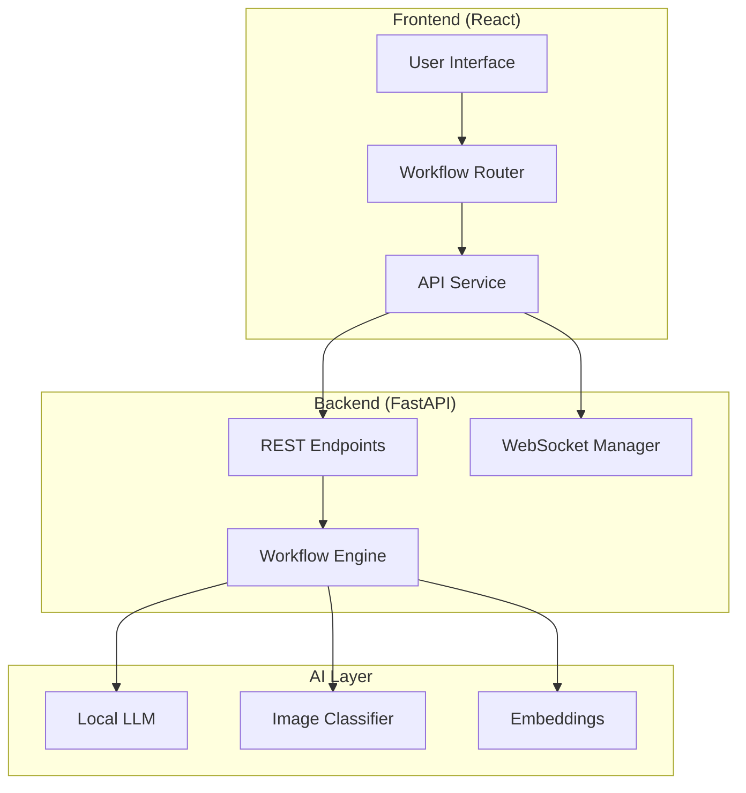

# Project Documentation

This document provides detailed information about the AI Medical Assistant Web App architecture, components, and workflows.

## 📋 Table of Contents

- [System Architecture](#system-architecture)
- [Backend Components](#backend-components)
- [Frontend Components](#frontend-components)
- [Workflow System](#workflow-system)
- [API Documentation](#api-documentation)
- [Model Integration](#model-integration)

## 🏗️ System Architecture

### Overview
The AI Medical Assistant uses a microservices architecture with clear separation between the AI processing backend and the user interface frontend.



### Technology Stack

| Layer | Technology | Purpose |
|-------|------------|---------|
| Frontend | React 19 + TypeScript | User interface and interaction |
| API Gateway | FastAPI | REST API and WebSocket handling |
| Workflow Engine | LangGraph | AI agent orchestration |
| AI Models | Llama.cpp, PyTorch | Local AI inference |
| State Management | Pydantic | Data validation and serialization |

## 🔧 Backend Components

### 1. Adapters Layer (`/adapters/`)

**Purpose**: Abstraction layer for different AI models and services

#### `base.py` - ModelInterface
```python
class ModelInterface(ABC):
    @abstractmethod
    async def load_model(self) -> None: ...
    
    @abstractmethod
    async def generate_diagnosis(self, symptoms: str, context: str = None) -> str: ...
```

#### `local_model_adapter.py` - LocalModelAdapter
- Integrates llama.cpp for local LLM inference
- Handles Llama 3.1-8B-UltraMedical model
- Provides medical diagnosis and follow-up generation

#### `skinlesion_efficientNet_adapter.py` - EfficientNetAdapter
- Integrates PyTorch EfficientNet for image classification
- Specializes in skin lesion analysis
- Returns classification probabilities and confidence scores

#### `embedder_adapter.py` - EmbedderAdapter
- Handles sentence transformers for text embeddings
- Provides similarity computation and clustering
- Used for symptom analysis and matching

### 2. API Layer (`/api/`)

#### `diagnosis_routes.py`
- Defines REST endpoints for medical workflow
- Handles multipart form data for images and text
- Manages session state and workflow progression

**Key Endpoints:**
```python
POST /patient/textual_analysis
POST /patient/followup_questions  
POST /patient/image_analysis
POST /patient/overall_analysis
POST /patient/healthcare_recommendations
```

### 3. Workflow System (`/graphs/`)

#### `patient_workflow.py`
- Defines LangGraph workflow for patient interaction
- Manages state transitions between nodes
- Handles routing based on confidence thresholds

### 4. Managers (`/managers/`)

#### `model_manager.py` - Singleton Pattern
```python
class ModelManager:
    _instance = None
    
    def __new__(cls):
        if cls._instance is None:
            cls._instance = super().__new__(cls)
        return cls._instance
```
- Ensures models are loaded only once
- Manages model lifecycle and resource allocation
- Provides global access to loaded models

#### `workflow_state_manager.py`
- Manages workflow state transitions
- Calculates confidence scores and thresholds
- Determines next workflow steps

#### `websocket_manager.py`
- Handles real-time WebSocket connections
- Manages session-based communications
- Provides live updates during processing

### 5. Nodes (`/nodes/`)

Each node represents a specific AI processing step:

#### `llm_diagnosis_node.py`
- Processes textual symptoms using LLM
- Extracts diagnoses with confidence scores
- Handles medical terminology and context

#### `follow_up_interaction_node.py`
- Generates clarifying questions
- Processes user responses
- Enhances diagnostic accuracy

#### `image_classification_node.py`
- Analyzes medical images (skin lesions)
- Provides classification results
- Integrates with EfficientNet model

#### `overall_analysis_node.py`
- Synthesizes all available data
- Provides comprehensive analysis
- Handles multiple data modalities

#### `healthcare_treatment_recommendation_node.py`
- Generates treatment recommendations
- Suggests specialist referrals
- Provides urgency assessments

#### `medical_report_node.py`
- Creates comprehensive medical reports
- Summarizes entire workflow
- Provides actionable insights

### 6. Schemas (`/schemas/`)

#### `medical_schemas.py`
```python
class AgentState(TypedDict, total=False):
    user_symptoms: Optional[str]
    textual_analysis: Optional[List[TextualSymptomAnalysisResult]]
    skin_lesion_analysis: Optional[SkinLesionImageAnalysisResult]
    followup_questions: Optional[List[str]]
    # ... additional fields
```

- Defines Pydantic models for data validation
- Ensures type safety across the application
- Handles serialization/deserialization

## ⚛️ Frontend Components

### 1. Pages (`/pages/`)

#### `DiagnosisFormPage.tsx`
- Initial symptom input form
- Handles text-based symptom collection
- Validates user input

#### `FollowUpQuestionsPage.tsx`
- Displays dynamic follow-up questions
- Collects user responses
- Validates completeness of answers

#### `ImageAnalysisPage.tsx`
- Handles medical image upload
- Provides image preview functionality
- Manages image classification workflow

#### `AnalysisProgressPage.tsx`
- Shows workflow progress
- Displays loading states
- Provides user feedback during processing

#### `RecommendationsPage.tsx`
- Displays treatment recommendations
- Shows specialist referrals
- Provides urgency indicators

#### `FinalReportPage.tsx`
- Comprehensive medical report display
- Summarizes entire workflow
- Provides downloadable report

### 2. Hooks (`/hooks/`)

#### `useDiagnosis.ts`
```typescript
export const useDiagnosis = () => {
  const [state, setState] = useState<DiagnosisState>({
    loading: false,
    result: null,
    error: null,
    sessionId: null,
    currentStage: null,
    workflowInfo: null
  });
  
  // Hook methods...
};
```

- Manages application state
- Handles API interactions
- Provides workflow control methods

### 3. Services (`/services/`)

#### `api.ts`
```typescript
export class ApiService {
  static async startTextualAnalysis(request: DiagnosisRequest): Promise<any>
  static async runFollowupQuestions(sessionId: string, responses: Record<string, string>): Promise<any>
  static async runImageAnalysis(sessionId: string, image: File): Promise<any>
  // ... additional methods
}
```

- Handles all backend API communications
- Manages request/response formatting
- Provides type-safe API interactions

### 4. Workflow (`/workflow/`)

#### `WorkflowRouter.tsx`
- Routes users to appropriate pages based on workflow state
- Manages workflow progression
- Handles error states and loading indicators

## 🔄 Workflow System

### Workflow Stages

1. **Textual Analysis** (`textual_analysis`)
   - Input: User symptoms description
   - Processing: LLM analysis
   - Output: Initial diagnoses with confidence scores

2. **Follow-up Questions** (`generating_followup_questions`)
   - Input: Initial diagnosis results
   - Processing: Dynamic question generation
   - Output: Clarifying questions for user

3. **Image Analysis** (`analyzing_image`)
   - Input: Medical image (optional)
   - Processing: EfficientNet classification
   - Output: Image-based diagnosis

4. **Overall Analysis** (`performing_overall_analysis`)
   - Input: All collected data
   - Processing: Comprehensive synthesis
   - Output: Final analysis results

5. **Healthcare Recommendations** (`healthcare_recommendation`)
   - Input: Final analysis
   - Processing: Treatment and referral logic
   - Output: Actionable recommendations

### State Management

```python
class WorkflowStateManager:
    def calculate_average_confidence(self, state: AgentState) -> float:
        # Calculate confidence from all analyses
        
    def update_workflow_stage_and_determine_next(self, state: AgentState, completed_node: str) -> Dict[str, Any]:
        # Determine next workflow step
```

## 📡 API Documentation

### Authentication
Currently, no authentication is required for the API endpoints.

### Request/Response Format

#### Textual Analysis
```http
POST /patient/textual_analysis
Content-Type: multipart/form-data

user_symptoms: "I have a headache and feel dizzy"
session_id: "session_123"
```

Response:
```json
{
  "textual_analysis": [
    {
      "text_diagnosis": "Tension headache with possible dehydration",
      "diagnosis_confidence": 0.85
    }
  ],
  "current_workflow_stage": "textual_analysis_complete",
  "session_id": "session_123"
}
```

#### Image Analysis
```http
POST /patient/image_analysis
Content-Type: multipart/form-data

image: <binary_image_data>
session_id: "session_123"
previous_state: <json_encoded_state>
```

### Error Handling

All endpoints return standardized error responses:
```json
{
  "error": "Model not loaded",
  "detail": "Local model is not initialized",
  "status_code": 500
}
```

## 🤖 Model Integration

### Local LLM Integration

```python
class LocalModelAdapter(ModelInterface):
    def __init__(self, llm_path: str):
        self.model_path = llm_path
        self.llm = None
        
    async def load_model(self):
        self.llm = Llama(
            model_path=self.model_path,
            n_ctx=4096,
            n_threads=4,
            verbose=False
        )
```

### Image Classification Integration

```python
class EfficientNetAdapter:
    def __init__(self, model_path: str):
        self.model_path = model_path
        self.model = None
        self.device = torch.device("cuda" if torch.cuda.is_available() else "cpu")
        
    async def classify_image(self, image: Image.Image) -> torch.Tensor:
        # Image preprocessing and classification
```

### Model Performance Optimization

1. **Lazy Loading**: Models are loaded only when first needed
2. **Singleton Pattern**: Each model is loaded once and reused
3. **Async Processing**: Non-blocking model inference
4. **Memory Management**: Efficient resource utilization

## 🔧 Configuration

### Environment Variables
```env
# Optional Hugging Face API token
hf_api="your_token_here"

# Google Maps API for specialist recommendations
google_maps_api="your_api_key"
```

### Model Paths
Configure in `backend/graphs/patient_workflow.py`:
```python
multipurpose_model_path = "ai_models/Llama-3.1-8B-UltraMedical.Q8_0.gguf"
embedding_model_name = "sentence-transformers/all-MiniLM-L6-v2"
```

## 🚀 Deployment Considerations

### Resource Requirements
- **RAM**: 8GB minimum for model loading
- **Storage**: 10GB+ for AI models
- **CPU**: Multi-core recommended
- **GPU**: Optional but improves performance

### Scaling Options
1. **Horizontal Scaling**: Multiple backend instances
2. **Model Sharding**: Split large models across instances
3. **Caching**: Redis for session state management
4. **Load Balancing**: Nginx for request distribution

## 🔒 Security Considerations

1. **Input Validation**: All user inputs are sanitized
2. **Session Isolation**: Each session is independent
3. **Local Processing**: No data sent to external services
4. **Memory Cleanup**: Sensitive data is cleared after processing

---

This documentation is actively maintained. For questions or clarifications, please open an issue on GitHub.
